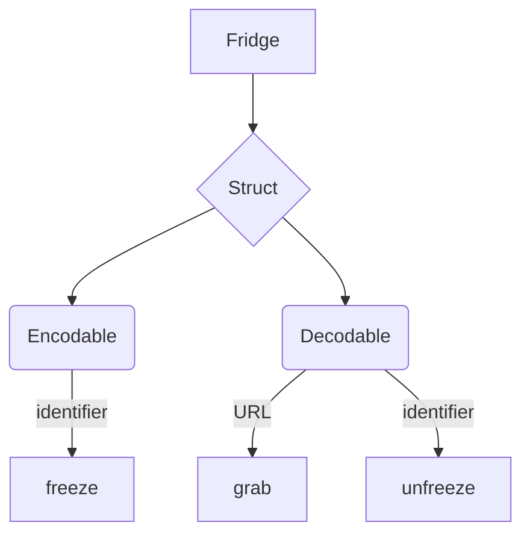
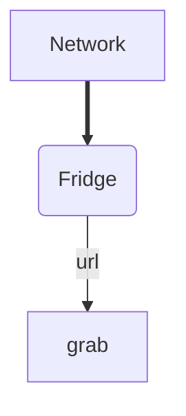
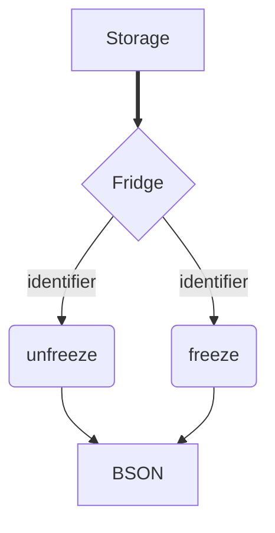

# Fridge architecture
Diagram below can be used to depict the structural layout of the Fridge library.  

## Network interface perspective
You can observer `Fridge` interface from the point of network in following way:  

By providing `url` or `urlRequest` objects (and conforming your struct to `Encodable`) you can `grab` network objects easily.

Keywords:  
**`url`**, **`grab`**

## Storage interface perspective

Keywords:  
**`identifier`**, **`freeze`**, **`unfreeze`**

---  
Copyright (c) by Vexy 2022  
Effective since: `2022-03-13`
